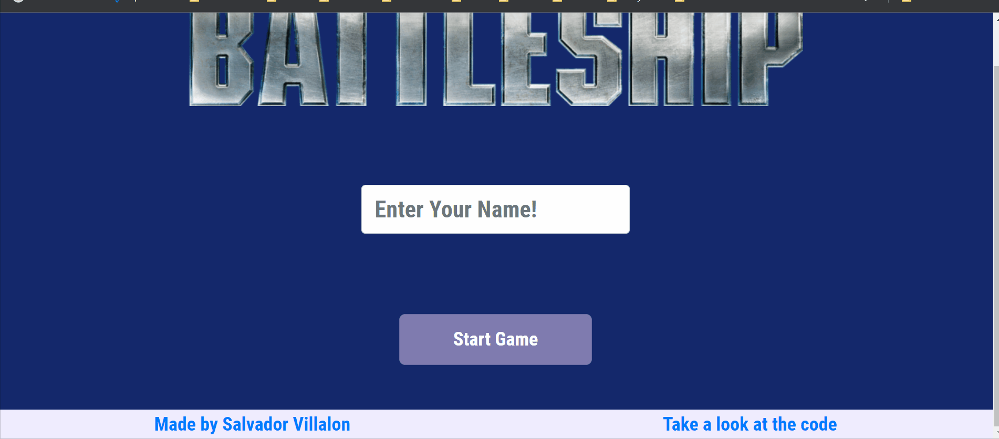

# Battleship
[The Odin Project: Javascript] - Project: Battleship

# Summary
Created a player versus computer Battleship game. Players can set five ships and change the rotation of the ship placement

In this project, the main goal was to practice using Test Driven Development. This was valuable as I got to practice implementing the logic of the game using Jest and did not have to rely on creating a UI or making many console.log statements. 

Apart from this, I wanted to practice how to use React Hooks, creating reusable components, creating reusable css selectors, and how to set up a project using eslint and prettier. Also, I got to practice using React Bootstrap since I wanted to start using it instead of using the Bootstrap html framework. One more thing was that I practiced creating a consistent comment structure for my files. Really excited what I came up with.

### Implementation 
- Used Jest to implement Test Drive Development. First I created tests to see if the logic worked, then I focused on the UI
- Implemented project using React. Created reusable components and CSS selectors
- Built with useLayoutEffect to help render the application again when I am trying to make changes to the DOM
- useRef when trying to use state values inside event listeners

### Demo


### 📗 Fonts used
-   [Roboto Condensed](https://fonts.google.com/specimen/Roboto+Condensed?query=Roboto+Condensed)

# Lessons Learned

1. I learned how to use **useLayoutEffect** that helped me render the application again in the case when I am trying to make changes to the dom! This was really helpful! This article really helped. I need to learn this: [https://medium.com/@guptagaruda/react-hooks-understanding-component-re-renders-9708ddee9928](https://medium.com/@guptagaruda/react-hooks-understanding-component-re-renders-9708ddee9928)

2. We found this very hard bug

    1. Basically everytime, I tried to place my second ship I got an error
    2. My thought process was
        1. First I thought there is something happening with the data, but then I checked the data and it was okay
        2. Then I thought okay lets remove the function that places the ships on the grid and just focus on the flow of when the user clicks on the cell
        3. This was really important since it allowed me to think of the functions that are being called
        4. I then realized that there was a function being called twice!
        5. **I used stopImmediatePropagation which "The stopImmediatePropagation() method of the Event interface prevents other listeners of the same event from being called"**
        6. This is exactly what my bug was

3. One of the biggest things is that we understood why I could not use state inside event listeners. **The listener belongs to the initial render and is not updated on subsequent rerenders**

    1. We had to use **useRef().** "useRef returns a mutable ref object whose .current property is initialized to the passed argument (initialValue). The returned object will persist for the full lifetime of the component." From the docs. Thanks to this article it really helped me a lot: [https://medium.com/geographit/accessing-react-state-in-event-listeners-with-usestate-and-useref-hooks-8cceee73c559](https://medium.com/geographit/accessing-react-state-in-event-listeners-with-usestate-and-useref-hooks-8cceee73c559)

4. I learned how to use [Surge.sh](http://surge.sh). Which is a great way to deploy your React apps. I did have some troubles, but I got it to work. These are the steps that I took

    1. Remove the homepage field in my package json
    2. If you get an error saying that "Aborted – you do not have permission to publish to [<[custom-domain.surge.sh](http://custom-domain.surge.sh/)>]"

        1. One potential cause is that the domain has been taken. This happened since I was trying to name my project [battleship.surge.sh](http://battleship.surge.sh). If you go the url you will see that the project has already been taken. Thanks to this article: [https://sunlightmedia.org/using-surge-for-deploying-static-sites/](https://sunlightmedia.org/using-surge-for-deploying-static-sites/)
        2. Then when I tried deploying I got an error where the page was blank so after looking around I found that you needed to add a 200.html file that contains the exact same code at index.html
        3. To make everything easier, I found this command to makes deploying faster. You can add this to your package.json under the scripts object. Thanks to this stackoverflow post: [https://stackoverflow.com/questions/57823877/getting-blank-page-after-deploying-react-app-to-surge-sh](https://stackoverflow.com/questions/57823877/getting-blank-page-after-deploying-react-app-to-surge-sh)

        ```jsx
        "deploy": "npm run build && cp build/index.html build/200.html && surge build theodinproject_battleship.surge.sh",
        ```

You can find more on the project here: [The Odin Project - Battleship](https://www.theodinproject.com/lessons/battleship)

# Technologies:

-   React
-   React Bootstrap
-   Surge.sh
-   ESLint
-   Prettier
-   Jest
